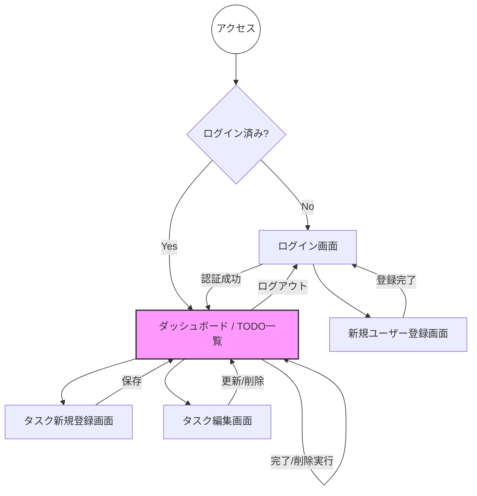

```mermaid
graph TD
    %% 外部からのアクセス
    Start((アクセス)) --> CheckAuth{ログイン済み?}

    %% ログイン判定
    CheckAuth -- No --> Login[ログイン画面]
    CheckAuth -- Yes --> Dashboard[ダッシュボード / TODO一覧]

    %% 認証フロー
    Login --> Register[新規ユーザー登録画面]
    Register -->|登録完了| Login
    Login -->|認証成功| Dashboard

    %% メイン機能フロー
    Dashboard --> TaskAdd[タスク新規登録画面]
    Dashboard --> TaskEdit[タスク編集画面]
    Dashboard -->|完了/削除実行| Dashboard
    
    TaskAdd -->|保存| Dashboard
    TaskEdit -->|更新/削除| Dashboard

    %% ログアウト
    Dashboard -->|ログアウト| Login

    %% デザイン注釈
    style Dashboard fill:#f9f,stroke:#333,stroke-width:2px
    style Start fill:#fff,stroke:#333
```